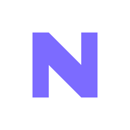

<p align="center">
  
</p>

<h1 align="center">NoNans</h1>

<p align="center">
  <strong>The numerical continuity layer for GPU computing.</strong>
</p>

<p align="center">
  <a href="https://nonans.com">nonans.com</a> ·
  <a href="https://nonans.com/benchmark.html">benchmark</a> ·
  <a href="docs/architecture.md">architecture</a> ·
  <a href="docs/quickstart.md">quickstart</a>
</p>

---

When a CUDA kernel produces a numerical singularity, NoNans detects it at the kernel boundary, resolves it inside our framework, and returns a finite, optimizer-coherent tensor to the GPU. Training continues at the next step. No rollback. No checkpoint reload. No code change.

This repository contains the **open-source detection layer** and the **public Python client** for the resolution runtime. The resolution mechanism itself is patent-pending and ships as a hosted service at `runtime.nonans.com` (or, for Enterprise on-prem, as a license-gated binary inside our public Docker image).

---

## What's in this repo

| Component | License | What it does |
|-----------|---------|--------------|
| `nonans/detect/` | MIT (open) | Singularity detection layer: kernel hooks, event taxonomy, telemetry pipeline. |
| `nonans/wrap.py` | MIT (open) | Public API. The three-line integration. |
| `nonans/client.py` | MIT (open) | Thin client that calls into the resolution binary. |
| `bench/` | MIT (open) | Reproducible benchmark harness. Same code that produces the numbers on the [benchmark page](https://nonans.com/benchmark.html). |
| `examples/` | MIT (open) | Working integration examples for PyTorch, FSDP, DeepSpeed, and vLLM. |
| **Resolution core** | **Proprietary** | **Not in this repo.** Ships compiled inside `ghcr.io/nonans/runtime` Docker image, gated by trial token. |

---

## Quick start

```bash
pip install nonans
```

```python
import nonans
import torch

model = YourModel().cuda()
model = nonans.wrap(model, mode='auto')

# Train as usual. NoNans only activates when a singularity is detected.
for batch in dataloader:
    loss = model(batch)
    loss.backward()
    optimizer.step()
```

The detection layer runs immediately. The resolution core is fetched on first use and runs under a 30-day trial token issued automatically. After 30 days, contact `infra@nonans.com` for Pro access or upgrade through the [pricing page](https://nonans.com/#pricing).

---

## Why this exists

The largest controllable cost in frontier model training is rework: runs that die at step N and resume from checkpoint at step N−K. This cost is structural: IEEE 754 has no defined value for the operations that cause the death.

NoNans defines them.

The same primitive applies to inference workloads (long-context softmax overflow, attention denominator collapse) and reinforcement learning (gradient norms swinging across orders of magnitude). One layer, multiple surfaces.

See the [benchmark page](https://nonans.com/benchmark.html) for reproducible results across:
- FP8 training stability
- Long-context attention (>1M tokens)
- Aggressive learning rates without warmup
- RLHF / GRPO / DPO post-training
- Mixed-precision pretraining

---

## What's open and what's not

**Open:**
- Detection layer (full source, MIT)
- Public API (full source, MIT)
- Benchmark harness (full source, MIT)
- Integration examples (full source, MIT)

**Closed:**
- The resolution mechanism. Patent pending. Ships only as a compiled binary, gated by trial token, GPU-UUID bound.

We do this for two reasons. First, the patent claim covers the system, not the math, and ships only in compiled form. Second, technical due diligence is conducted by reproducing behavior on real workloads, not by reading source. The benchmark is the proof.

---

## License

Open components: [MIT](LICENSE).
Resolution binary: [Commercial license](LICENSE-COMMERCIAL.md). Trial-token issuance is automatic for the first 30 days.

---

## Contact

- **Engineering:** infra@nonans.com
- **Enterprise:** infra@nonans.com (subject: Enterprise Inquiry)
- **MNDA replication kit:** infra@nonans.com (subject: MNDA Replication Kit Request)
- **Security disclosure:** security@nonans.com

© 2026 NoNans · Patent Pending
